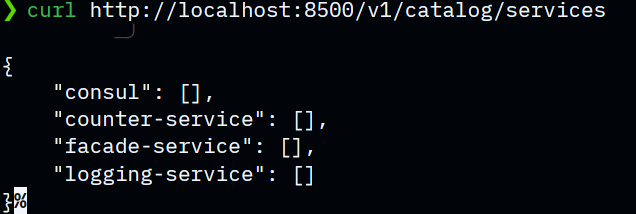
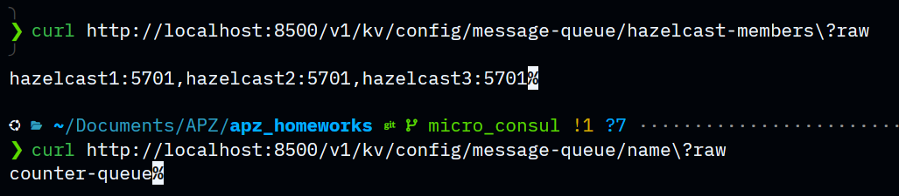
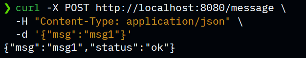
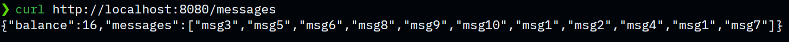
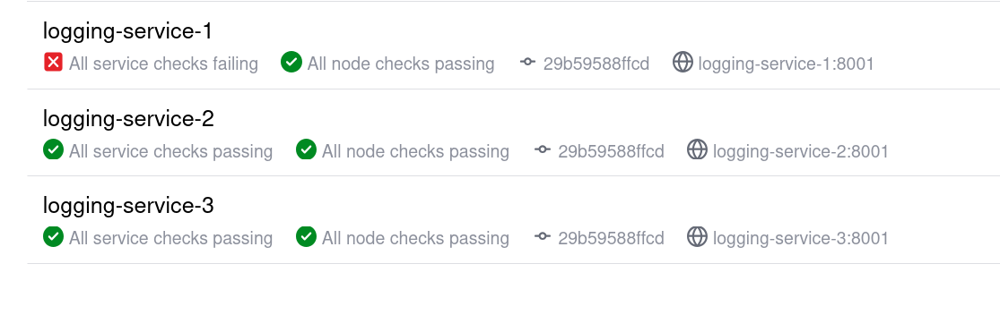
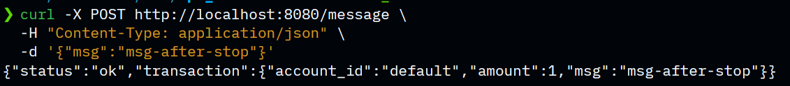
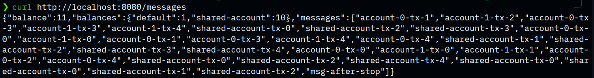

# HW 5 - Microservices with Consul

Services:
- `facade-service` x 2: entry point on `localhost:8080` and `localhost:8081`
- `logging-service` x 3: stores received messages in memory
- `counter-service` x 2: consumes the Hazelcast queue and stores shared balance in Hazelcast
- `consul`: service registry, health checks, UI, and KV config on `localhost:8500`
- `hazelcast` x 3: distributed queue backend

Consul KV entries are created automatically by `consul-init`:
- `config/hazelcast/members`
- `config/message-queue/hazelcast-members`
- `config/message-queue/name`

## Demo Flow

### 1. Start The System

Run all infrastructure and service instances:

```bash
docker compose up --build
```

Expected result:
- Consul starts on `http://localhost:8500`
- 3 Hazelcast nodes start
- 2 `facade-service` instances start
- 3 `logging-service` instances start
- 2 `counter-service` instances start

### 2. Check Running Containers

Verify that all containers are running:

```bash
docker compose ps
```

Expected result: all Consul, Hazelcast, facade, logging, and counter containers are `Up`.

### 3. Verify Service Registration In Consul

Open Consul UI:

```text
http://localhost:8500
```

Or check registered service names from the terminal:

```bash
curl http://localhost:8500/v1/catalog/services
```

Expected result:
- `facade-service`
- `logging-service`
- `counter-service`
- `consul`



Check registered service instances:

```bash
curl "http://localhost:8500/v1/health/service/facade-service?passing=true"
curl "http://localhost:8500/v1/health/service/logging-service?passing=true"
curl "http://localhost:8500/v1/health/service/counter-service?passing=true"
```

Expected result:
- 2 passing `facade-service` instances
- 3 passing `logging-service` instances
- 2 passing `counter-service` instances

### 4. Verify Consul KV Configuration

Check Hazelcast client configuration used by `logging-service`:

```bash
curl http://localhost:8500/v1/kv/config/hazelcast/members?raw
```

Expected value:

```text
hazelcast1:5701,hazelcast2:5701,hazelcast3:5701
```

Check Message Queue configuration used by `facade-service` and `counter-service`:

```bash
curl http://localhost:8500/v1/kv/config/message-queue/hazelcast-members?raw
curl http://localhost:8500/v1/kv/config/message-queue/name?raw
```

Expected values:

```text
hazelcast1:5701,hazelcast2:5701,hazelcast3:5701
counter-queue
```



### 5. Send Messages Through Facade

Create one message:

```bash
curl -X POST http://localhost:8080/message \
  -H "Content-Type: application/json" \
  -d '{"msg":"msg1"}'
```

Expected response:

```json
{"msg":"msg1","status":"ok"}
```



Send 10 messages:

```bash
for i in $(seq 1 10); do
  curl -s -X POST http://localhost:8080/message \
    -H "Content-Type: application/json" \
    -d "{\"msg\":\"msg$i\"}"
  echo
done
```

### 6. Read Messages And Balance

Read logged messages and processed balance through `facade-service`:

```bash
curl http://localhost:8080/messages
```

Expected result:
- response contains logged messages
- `balance` increases after `counter-service` consumes messages from the Hazelcast queue



### 7. Inspect Microservice Logs

Check facade logs:

```bash
docker logs facade-service-1
```

Check logging-service logs:

```bash
docker logs logging-service-1
docker logs logging-service-2
docker logs logging-service-3
```

Check counter-service logs:

```bash
docker logs counter-service-1
docker logs counter-service-2
```

Expected result:
- `facade-service` shows messages being queued and logged through a Consul-discovered `logging-service`
- `logging-service` instances show received messages
- `counter-service` instances show queue consumption and balance updates

### 8. Demonstrate Fault Tolerance

Stop one logging instance:

```bash
docker stop logging-service-1
```

Wait a few seconds and check passing logging instances:

```bash
curl "http://localhost:8500/v1/health/service/logging-service?passing=true"
```

Expected result: `logging-service-1` is not in the passing list, while `logging-service-2` and `logging-service-3` remain available.

Consul UI should show that the stopped instance changed status:



Send a new message while one instance is stopped:

```bash
curl -X POST http://localhost:8080/message \
  -H "Content-Type: application/json" \
  -d '{"msg":"msg-after-stop"}'
```



Read data again:

```bash
curl http://localhost:8080/messages
```

Expected result:
- POST still returns `ok`
- request is routed to another healthy `logging-service` instance
- balance still increases



Restore the stopped instance:

```bash
docker start logging-service-1
```

After the health check passes, Consul shows 3 passing `logging-service` instances again.

## Performance Results

Run the performance check after the stack is started:

```bash
python3 scripts/performance_test.py
```

| Metric | Lab 1 | Lab 3 | Lab 5 |
| :-- | :-- | :-- | :-- |
| req/s scenario 1 | 124 req/s | 108.5 req/s | 215.97 req/s |
| req/s scenario 2 | 120.9 req/s | 111.1 req/s | 235.85 req/s |
| logging total time (s) | 4630.7 s | 5375.796 s | 76.783 s / 48.915 s |
| counter total time (s) | 4616.9 s | 5445.487 s | 713.733 s / 648.468 s |
