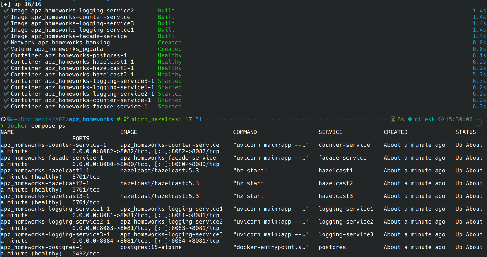
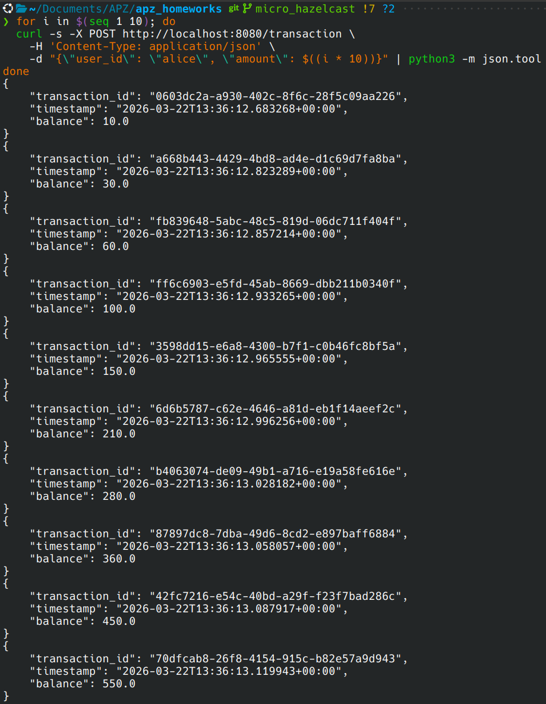
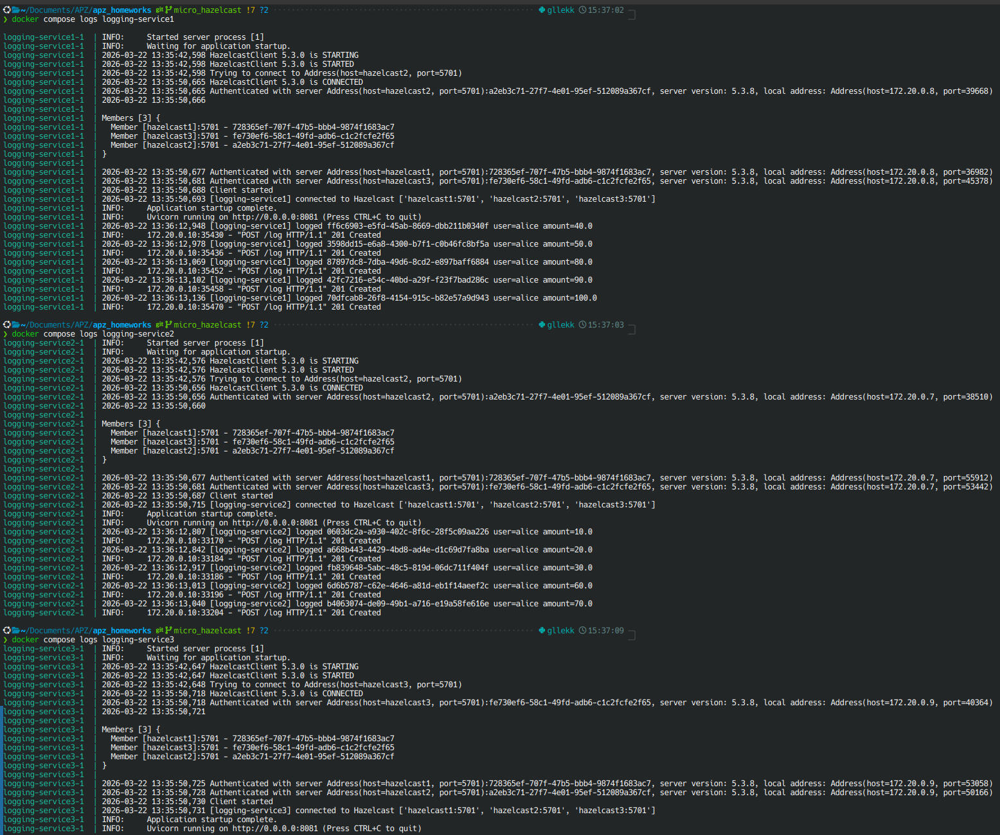
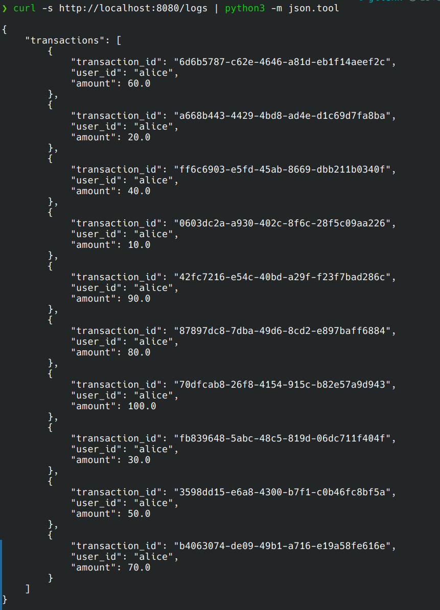
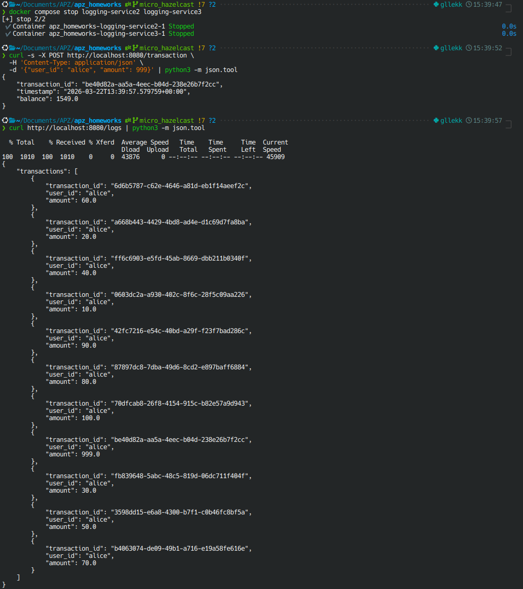
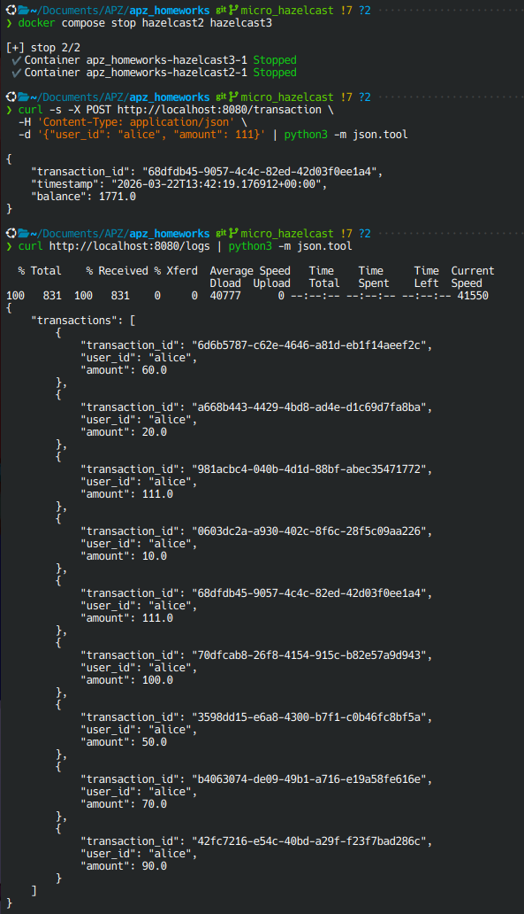
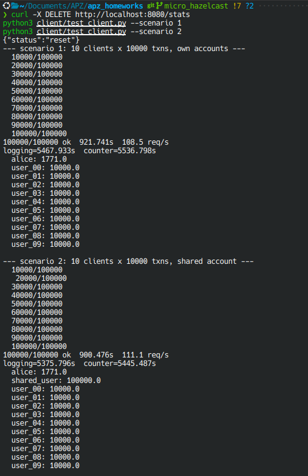

# Lab 3: Microservices with Hazelcast

**Author:** Roman Pavlosiuk
**GitHub:** https://github.com/gllekkoff/apz_homeworks/tree/micro_hazelcast

---

## 1. Start all services

```bash
./run.sh --up
docker compose ps
```


---

## 2. POST 10 transactions

```bash
for i in $(seq 1 10); do
  curl -s -X POST http://localhost:8080/transaction \
    -H 'Content-Type: application/json' \
    -d "{\"user_id\": \"alice\", \"amount\": $((i * 10))}" | python3 -m json.tool
done
```


---

## 3. Which instance handled each message

```bash
docker compose logs logging-service1
docker compose logs logging-service2
docker compose logs logging-service3
```



---

## 4. GET all transactions

```bash
curl http://localhost:8080/logs | python3 -m json.tool
```



---

## 5. Fault tolerance — logging instances

```bash
docker compose stop logging-service2 logging-service3

curl -s -X POST http://localhost:8080/transaction \
  -H 'Content-Type: application/json' \
  -d '{"user_id": "alice", "amount": 999}' | python3 -m json.tool

curl http://localhost:8080/logs | python3 -m json.tool

docker compose start logging-service2 logging-service3
```


---

## 6. Fault tolerance — Hazelcast nodes

```bash
docker compose stop hazelcast2 hazelcast3

curl -s -X POST http://localhost:8080/transaction \
  -H 'Content-Type: application/json' \
  -d '{"user_id": "alice", "amount": 111}' | python3 -m json.tool

curl http://localhost:8080/logs | python3 -m json.tool

docker compose start hazelcast2 hazelcast3
```


---

## 7. Performance test

```bash
curl -X DELETE http://localhost:8080/stats
python3 client/test_client.py --scenario 1
python3 client/test_client.py --scenario 2
```



| Metric | Lab 1 | Lab 3 |
|---|---|---|
| req/s scenario 1 | 124 req/s | 108.5 req/s |
| req/s scenario 2 | 120.9 req/s, | 111.1 req/s |
| logging total time (s) | 4630.7s | 5375.796s |
| counter total time (s) | 4616.9s | 5445.487s |
