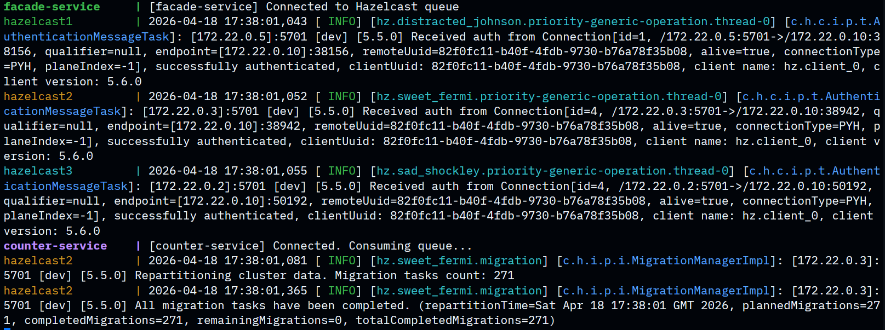
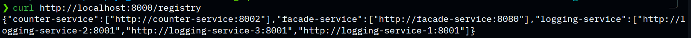
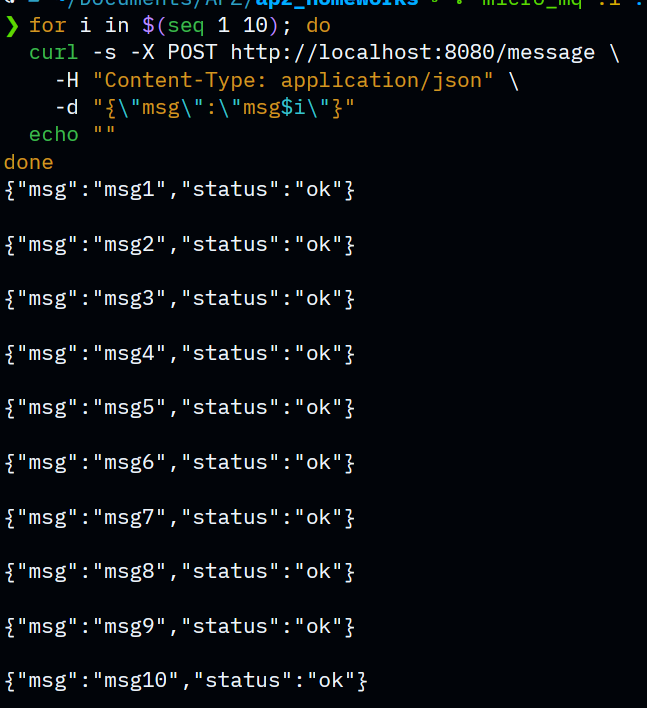
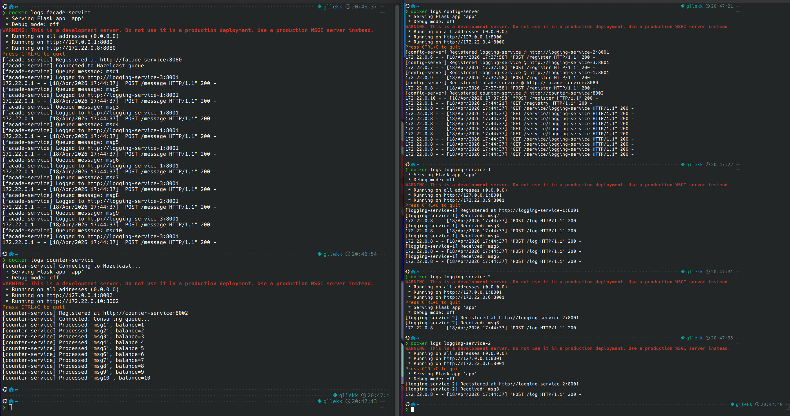
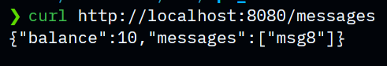
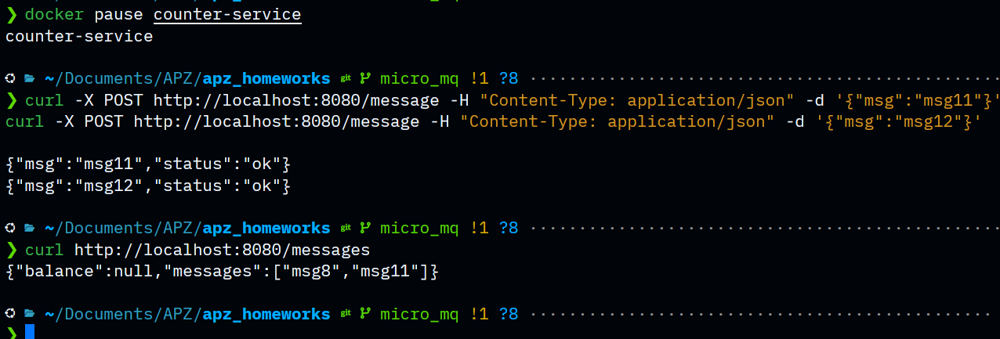
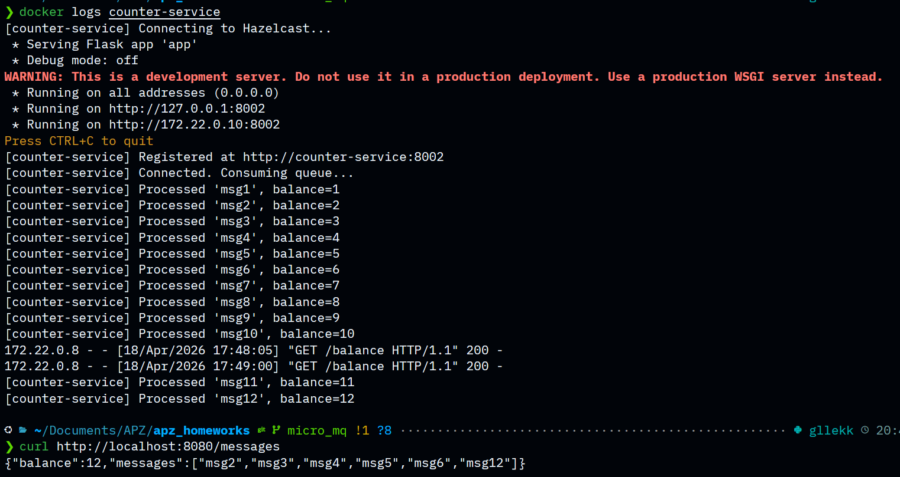

# Lab 4 — Microservices with Message Queue

Four microservices with a Hazelcast cluster for asynchronous transaction processing via a distributed message queue.

**Services:**
- `config-server` (`:8000`) — service registry; stores addresses of all instances
- `logging-service` × 3 (`:8011–8013`) — stores received messages in memory
- `counter-service` (`:8002`) — consumes Hazelcast queue, increments balance per message
- `facade-service` (`:8080`) — entry point; POST puts message in queue + logs it; GET reads logs and balance
- Hazelcast cluster × 3 — distributed queue `counter-queue`

## Start

```bash
docker-compose up --build
```

## API
POST a transaction
```bash
curl -X POST http://localhost:8080/message -H "Content-Type: application/json" -d '{"msg":"msg1"}'
```

GET transactions + balance
```bash
curl http://localhost:8080/messages
```

---

## Report

### 1. Start config-server and all services

```bash
docker-compose up --build
```



---

### 2. Service registration in config-server

```bash
curl http://localhost:8000/registry
```



---

### 3. Send 10 transactions (msg1–msg10)

```bash
for i in $(seq 1 10); do
  curl -s -X POST http://localhost:8080/message \
    -H "Content-Type: application/json" \
    -d "{\"msg\":\"msg$i\"}"
  echo ""
done
```



---

### 4. Logging-service logs (different instances receive messages)

```bash
docker logs logging-service-1
docker logs logging-service-2
docker logs logging-service-3
```



---

### 5. GET transactions and balance

```bash
curl http://localhost:8080/messages
```



---

### 6. Fault tolerance — pause counter-service

```bash
docker pause counter-service
```

POST still returns OK (messages accumulate in queue):

```bash
curl -X POST http://localhost:8080/message -H "Content-Type: application/json" -d '{"msg":"msg11"}'
```

GET returns `null` for balance:

```bash
curl http://localhost:8080/messages
```



---

### 7. Resume counter-service

```bash
docker unpause counter-service
```

After a few seconds counter-service drains the accumulated queue and returns correct balance:

```bash
docker logs counter-service
curl http://localhost:8080/messages
```


